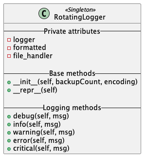

# Python Rotating Logger

Python package implementing a singleton logger object using rotating
file handling. 

## Installation

Use the pip install to install this package:

```shell
pip3 install https://github.com/romainmrad/rotating_logger.git
```

## UML Diagram



## Usage

Import the class and instantiate it

```python
import rotatinglogger

logger = rotatinglogger.RotatingLogger(
    backup_count=30,
    encoding='utf-8'
)

logger.info("Hello world")
logger.error("This is an error")
```
